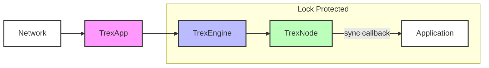

## Trex2: Paxos Algorithm Strong consistency for cluster replication on the Java JVM

### TL;DR

This repository contains a Java library that implements the Paxos algorithm as described in Leslie Lamport's 2001
paper [Paxos Made Simple](https://lamport.azurewebsites.net/pubs/paxos-simple.pdf) that optionally supports [Flexible Paxos: Quorum intersection revisited](https://arxiv.org/pdf/1608.06696v1). 
This implementation aims to be rigorous in terms of safety preferring to mark a node as crashed rather than ignoring any possible safety violation.
The core library has brute force property tests that check all branches and all input permutations to confirm the algorithm invariants are never violated.

The library is a toolkit to help you to embed logic to replicate an ordered sequence of application commands
over a network. You can use the full set of features or just the core algorithm code. It has a pluggable journal for 
persistence that allows you to use your main application database or an embedded database. It has a pluggable network 
transport layer that allows you to use your own application messaging or an optional low-latency encrypted UDP protocol.

The host process using this library must supply an application 
callback that will be invoked when command values are chosen by the algorithm. 

To use this library:

* You will need to implement the `Journal` interface to persist the state of the algorithm. This can be tables (or
  documents or key-values) in your main database.
* At this time you will need to set up the cluster membership manually. You will need to assign a unique node identifier
  to each node in the cluster.
* This library is designed to be transport agnostic when passing protocol messages between nodes in the cluster. You can 
  use your own application messaging layer (e.g. REST or gRPC). There is an optional encrypted UDP network protocol in this repository. 

At this the time:

1. There are JQwik property tests that the algorithm is never violated that exhaustive check every inequality. 
2. There are runtime checks that the algorithm is never violated.
3. The library will mark itself as crashed if it spots problems such a journal write errors.
4. There are junit tests that simulate randomized rolling network partitions 1,000 times.
5. There is support for Flexible Paxos (FPaxos) quorum strategies.

This repository includes a low-overhead UDP based encrypted network protocol inspired by QUIC called [PAXE](./trex-paxe/PAXE.md).
This can be optionally be embedded into your application to perform the Paxos message enchanges.

See the Architecture section for a more detailed explanation of how to use the library.

### Introduction

The ambition of this documentation is to:

1. Provide sufficient detail about the invariants described in the original paper to transcribe them into rigorous
   tests.
2. Clarify that the approach taken in this implementation is based on a careful and thorough reading of the original
   papers, watching Lamport's videos, and careful research of other implementations.
3. Provide sufficient detail around the "learning" messages used by this implementation to understand that they are
   minimal and do not harm correctness.
4. Provide enough documentation so that someone can carefully study the code, the tests, and the papers to verify this
   implementation with far less overall effort than it would take them to write any equivalent implementation.
5. Explicitly explain the design decisions in this implementation.

The description below refers to server processes as "nodes" within a cluster. This helps to disambiguate the library code
running the algorithm from the physical server or host process. 

## The Problem We're Solving

Imagine you have multiple servers that need critical configuration to be consistent across them all.
Configuration such as:

- Which servers are currently active in the cluster
- What data partition does each server manage
- Which server is currently the primary for each service

Even a slight inconsistency in this configuration can cause chaos—servers might fight over the same data or ignore it
entirely. This can lead to data loss or data corruption.

## How Paxos Helps

Paxos solves this by turning our servers into a distributed state machine where:

1. Every change is treated as a command (like "Set Key 4 to Value 5" or "Assign Partition-3 to Server-2")
2. A leader server puts these commands in a specific order
3. All servers apply these commands in exactly the same order

The [Paxos Made Simple](https://lamport.azurewebsites.net/pubs/paxos-simple.pdf) paper states (p. 8):

> A simple way to implement a distributed system is as a collection of clients that issue commands to a central server.
> The server can be described as a deterministic state machine that performs client commands in some sequence. The state
> machine has a current state; it performs a step by taking as input a command and producing an output and a new state.

It later explicitly states that Paxos has a leader (p. 6):

> The algorithm chooses a leader, which plays the roles of the distinguished proposer and the distinguished learner.

It also states that the leader only needs to exchange the minimum number of messages (p. 10):

> A newly chosen leader executes phase 1 for infinitely many instances of the consensus algorithm. Using the same
> proposal number for all instances, it can do this by sending a single reasonably short message to the other servers.

This means command values are forwarded to the leader, and the leader assigns the order of the command values.

In a three node cluster the leader can stream commands to the other two nodes. When it gets back one response it
knows that a given command is committed. Leader election is is also built into the algorithm which is explained below.

### The Paxos Algorithm

This description will explain it in the following order:

* First, explain that promises apply to both core message types.
* Second, explain the steady state of the algorithm, which uses only `accept` messages.
* Third, explain how nodes may efficiently learn which values have been fixed.
* Fourth, explain the leader take-over protocol, which is the most complex step that uses both `prepare` and `accept`
  messages.
* Fifth, explain the durable state requirements.
* Sixth, explain the invariants and testing.
* Seventh, provide a footnote on leader duels.

### First: Promises, Promises

The core algorithm uses only two protocol messages, `prepare(_,N)` and `accept(_,N,_))` where `N` is called a ballot
number or a proposal number. Nodes promise to reject protocol messages associated with a lower number than the last `N`
they did not reject. This means each node stores the highest `N` it has previously acknowledged.

If you have studied Paxos before, you may be surprised to learn that nodes must make promises to both message types.
Lamport talks about this fact in a video lecture. He describes it as the only ambiguity in his 2001 paper Paxos Made
Simple. He explains that this detail is included in his formal TLA+ specification of the Paxos Algorithm.

The number `N` must be unique to a given node for the algorithm to be correct. Lamport writes (p. 8):

> Different proposers choose their numbers from disjoint sets of numbers, so two different proposers never issue a
> proposal with the same number.

This is achieved by encoding the node identifier in each `N`s lower bits.
This library uses a record with a signature similar to this:

```java
/// This is `N`
public record BallotNumber(int counter, short nodeIdentifier) implements Comparable<BallotNumber> {
}
```

The `compareTo` method treats the four-byte counter as having the most significant bits and the
two-byte `nodeIndentifier` as having the least significant bits. The cluster operator must ensure they assign unique
`nodeIdentifier` values to every node added to the cluster.

In this implementation, nodes never recycle their numbers. They increment their counter each time they attempt to lead.
This avoids the need to retransmit values when fixing slots, as explained below.

### Second: Steady State Galloping

The objective is to fix the same command value `V` into the same command log stream index `S`, known as a log slot, at
each node in the cluster. When the network is healthy, and servers have undertaken crash recovery, an uncontested leader
sends a stream of commands using `accept(S,N,V)` messages where:

* `S` is a log index slot the leader assigns to the command value.
* `N` is a node's unique ballot number.
* `V` is a command value.

The value `V` is fixed at slot `S` when a mathematical majority of nodes journal the value `V` into their log. No matter
how many leaders attempt to assign a value to the same slot `S`, they will all assign the same `V` using different
unique `N` values. How that works is described below.

We can call this steady-state galloping, as things move at top speed using a different stride pattern than when
walking (or trotting). A leader will self-accept and transmit the message to the other two nodes in a three-node
cluster. It only needs one message response to learn that a mathematical majority of nodes in the cluster have accepted
the value. That is the minimum number of message exchanges required to ensure that the value `V` is fixed. Better yet,
our leader can stream `accept` messages continuously without awaiting a response to each message.

This library uses code similar to the following as the `accept` message and its acknowledgement:

```java
/// This is `V`
public record Command(String uuid,
                      byte[] operationBytes) {
}

/// This is `N` that is unique per Node
public record BallotNumber(int counter, short nodeIdentifier) {
}

/// This is `accept(S,N,V)`
public record Accept(long logIndex,
                     BallotNumber number,
                     Command command) {
}

/// This is whether another node accepts and simultaneously promises else rejects 
public record AcceptResponse(
    long logIndex,
    BallotNumber number,
    boolean vote) {
}
```

The boolean `vote` implies each node may
respond with either a positive acknowledgement or a negative acknowledgement.
This implementation includes negative acknowledgements to both `prepare` and `accept`
messages. When a leader receives a majority negative response, it abdicates. 

If you check the actual code the description above misses off some small optional implementation details that support
UPaxos cluster reconfigurations as per the paper [Unbounded Pipelining in Dynamically Reconfigurable Paxos Clusters](http://tessanddave.com/paxos-reconf-latest.pdf).

* The `Command` type has an optional `flavour` byte so that optional cluster reconfiguration command that add or remove 
cluster nodes to commands to be hidden from the host application(s). It also allows multiple appliations to share the 
same paxos cluster.  
* The `BallotNumber` has an optional `era` field so that a leader can use its casting vote to decide when the next `era` 
comes into effect. 

### Third: Learning Which Values Are Fixed

Any value `V` journaled into slot `S` by a mathematical majority of nodes will never change. Cloud environments
typically only support point-to-point messaging. This means that `AcceptResponse` messages are only sent to the leader.
As the leader is the first to learn which values are fixed, Lamport calls it the “distinguished learner”.

The leader can send a short `fixed(S,N)` message to inform the other nodes when a value has been fixed. This message can
piggyback at the front of the subsequent outbound `accept` message network packet. Due to lost messaging, a leader may
learn which slots are fixed out of sequential order. In this implementation leaders only send `fixed` messages in
sequential slot order.

Leaders must always increment their counter to create a fresh `N` each time they attempt to lead. That ensures that each
`fixed(S,N)` refers to a unique `accept(S,N,V)` message. If any node does not have the matching
`accept(S,N,V)` in its journal, it must request retransmission. This implementation uses a `catchup` message to request
the
retransmission of missed `accept` messages.

The pairing of `{S,N}` is referred to as a "slot term" within the codebase.

This implementation uses code similar to the following to allow nodes other than the leader to learn which values have
been fixed:

```java
public record Fixed(
    BallotNumber number,
    long fixedLogIndex) {
}

public record Catchup(long highestFixedIndex) {
}

public record CatchupResponse(List<Accept> catchup) {
}
```

Each node learns which value `V` is fixed into each sequential slot `S`.
Each node will then up-call the command value `V` to the host application.

### Fourth: The Leader Takeover Protocol

On leader election (p. 7):

> A reliable algorithm for electing a proposer must use either randomness or realtime — for example, by using timeouts.
> However, safety is ensured regardless of the success or failure of the election.

This library implements leader failure detection by heartbeating `fixed` messages. Leader election is then by
random timeouts. The core algorithm is in a single class
`TrexNode` class. The timeout logic is in the `TrexEngine` class. This allows you to use a different
failure detection library if you wish.

When a node times out it attempts to run the leader takeover protocol:

1. The new leader sends `prepare(N,S)` for all slots any prior leader has attempted to fix
2. For each slot nodes respond with promise messages containing any unfixed `{S,N,V}` tuples else only `{S,N}` when it
   has no value in that slot.
3. For each slot the leader selects the `V` that was associated with the highest `N` value from a majority of responses.
   If there was no value known at that slot by a majority then the new leader can safely use its own command value `V`
   at that slot.
4. For each slot the leader sends fresh `accept(S,N',V)` messages with chosen command `V` using its own higher `N'` for
   each slot.

That description says that the leader takeover protocol is to run the full algorithm for many slots. This can happen in
parallel for many slots.
The only question is what is the range of slots that we need to recover. It is the range of slots up to the maximum slot
any node has journaled a value.
We can ask a majority of nodes the highest slot at which they have accepted a value.

This library uses code similar to the following for the `prepare` message and its acknowledgement:

```java
public record Prepare(long logIndex,
                      BallotNumber number) {
}

public record PrepareResponse(
    long logIndex,
    Optional<Accept> highestUnfixed,
    long highestAccepted,
    boolean vote) {
}
```

We use `highestAccepted` value to learn the full range of slots
that any past leader has attempted to fix.

Again, whenever a node receives either a `prepare` or `accept` message protocol message with a higher `N` that it
replies to positively, it has promised to reject any further protocol messages with a lower `N`. Again,
when a leader learns that a slot is fixed in sequence, it will issue a `fixed(S,N)`. Again, if it gets a majority
negative
acknowledgement for any slot, it abdicates.

In this implementation, a new leader first issues a `prepare` for the slot immediately after the highest slot it knows
was fixed.
The new leader instantaneously sends the response message to itself and instantaneously
responds, which is a message that includes its own `highestAccepted`. When it gets a majority
positive response, it computes `max(highestAccepted)` to know all the slots it must recover.
It then streams `prepare` messages for the full range of slots.

Intuitively, we can think of the first message as a leader election. Hence, we call
`N` a ballot number, and we consider the responses to be votes.
In a three-node cluster, a leader only needs to exchange one
message to be elected.

Once elected, a new leader immediately issues small `prepare`
messages for the full range of slots. Intuitively the new leader is
asking nodes to retransmit what they know about all past `accept` messages.
The new leader then collaborates with an old leader
by choosing their value. The mathematics of the Paxos algorithm
guarantees that all leaders converge on selecting the same value
at each slot.

## Fifth, Durable State Requirements

The state of each node is similar to the following model:

```java
public record Progress(BallotNumber highestPromised,
                       long fixedIndex) {
}
```

The progress of each node is its highest promised `N` and its highest fixed slot `S`. This is only fourteen bytes of
data.

You must also provide an implementation of the journal interface, which is similar to this definition:

```java

public interface Journal {
  // this is only called at startup so you could trade write speed for read speed. 
  Progress loadProgress();

  // this is called on every message to persist a small amount of data so you would 
  // want to optimise this for write speed.
  void writeProgress(Progress progress);

  // this is called to write data to disk. when there are no crashes or isolated 
  // leaders each slot is write once yet can be rewritten using a fresh value during 
  // leader over.
  void writeAccept(long logIndex, Accept accept);

  // this is called during leader failover or help other nodes catch up on lost messages. 
  // We can expect sequential access patterns. 
  Optional<Accept> readAccept(long logIndex);

  // if the host application is not explicitly managing database transactions this will 
  // be called to make all the crash durable. 
  void sync();

  // this is used during startup to recover the previous progress
  long highestAcceptedSlot();
}
```

Journal writes must be crash-proof (disk flush or equivalent). The journal's `sync()` is intended to flush any
commands into their slots and only then flush the `progress`. The idea is that your application
already has a database; it is almost trivial to implement this interface in our main application database.
You can specify that your application code will manage transactions. When you configure this library to
say that you will handle the transactions in your command value up-call callback then the `sync()` method
will not be invoked.

See the Java doc on the `Journal` interface for more details.

## Sixth, The invariants & Testing

This implementation enforces the following invariants at each node:

1. The fixed index increases sequentially.
2. The promise number only increases (yet it may jump forward).
3. The promised ballot number can only change when processing a `prepare` or `accept` message.
4. The fixed index can only change when a leader sees a majority `AcceptReponse` message, a
   follower node sees a `Fixed`message, or any node learns about a fixed messages due to a
   `CatchupResponse` message.

The core of the algorithm is written as inequalities comparing integer types. We can exhaustively
test all permutations as a `TrexNode`:

* Can only see messages that are less than, greater than, or equal to its promise.
* Can only see messages from another node with a node identifier that is less than, greater than, or equal to its
  own.
* Can only see messages with a fixed slot index that are less than, greater than, or equal to its own.
* The journal at any slot can have only no value, the no-operation value, or a client command value.
* The journal can either be continuous, have gaps, or not have reached a specific index when that index is learnt to be
  fixed.
* The outcome of any majority vote can only be WIN, LOSE, or WAIT.
* The node can be in one of three TrexStates: `FOLLOW`, `RECOVER`, or `LEAD`.

In addition to exhaustive property-based tests, the tests run simulations of randomised rolling network partitions that
step through
hundreds of in-memory message exchanges between a three-node cluster. These randomised simulation tests are run a
thousand times and
check that the journal at all three nodes matches and the list of fixed commands is the same across all three nodes.

### Seventh, Leader Duels

The [paper](https://lamport.azurewebsites.net/pubs/paxos-simple.pdf) states (p. 7):

> It’s easy to construct a scenario in which two proposers each keep issuing
> a sequence of proposals with increasing numbers, none of which are ever
> chosen.

One pathological scenario exists for a stable network where nodes repeated timeout in an unlucky order, such:

* The first node to timeout has the lowest node identifier.
* The second node to timeouts does so before the first node can fix a value into the next slot.

Yet there is also the other scenario where the first node to timeout has the highest node identifier. Then, the second
node to timeout does not interrupt. If you were to set things up so that you had a 50% probability of two nodes
timing out within the time it takes them to complete a full slot recovery, you have great odds.

For every timeout you have two chances of success: that the first node to timeout has the highest node identifier, and
if
not
that the lower node is not interrupted before it can complete a full cycle. The odds of success each attempt to elect
a leader are 75%, 94%, 99%, ...

This implementation separates the core algorithm into TrexNode and the timeout logic is external. It will allow you
to use your own node failure detection or election mechanism if you do not like those odds.

See the wiki for a more detailed explanation of this topic.

## FPaxos "Flexible Paxos: Quorum intersection revisited"

The paper [Flexible Paxos: Quorum intersection revisited](https://arxiv.org/pdf/1608.06696v1) describes a way to improve 
the performance of Paxos by allowing the leader to accept values without waiting for a majority of responses. 

This codebase supports this by making `QuorumStrategy` an interface. There is a `SimpleQuorumStrategy` that implements a
standard majority quorum strategy. There is also a `FlexibleQuorumStrategy` where each server may have a voting weight
and the quorum size for prepare messages or accept messages may be set to a different values. This is particularly useful 
when you want to run pairs of servers in cloud resilience zones or different datacenters. 

The two different quorums are validated to satisfy the safety property that 
$$|P|+|A|>N$$ where N is the total number of nodes, $$|P|$$ is the number of nodes that made promises, and $$|A|$$ is 
the number of nodes that accepted values. 

See [FPaxos](FPaxos.md) for more details. 

## UPaxos

The [UPaxos](https://davecturner.github.io/2016/06/09/unbounded-pipelining-paxos.html) technical paper describes a way 
to change the cluster membership without any stalls. To support this in a future update our actual 
ballot number record has an optional era: 

```java
public record BallotNumber(short era, int counter, short nodeIdentifier) implements Comparable<BallotNumber> { }
```

## Development Setup

```bash
./setup-hooks.sh
```

# Architecture

The core components of the library are:

- `TrexApp<COMMAND,RESULT>`: Main entry point that runs Paxos consensus on commands across a cluster and transforms
  chosen commands into results locally at each node.
- `TrexNode`: Implements the core Paxos algorithm, processing messages and maintaining consistency.
- `TrexEngine`: Manages timeouts and heartbeats around the core algorithm.
- `Journal`: Interface for crash-durable storage of protocol state and commands.
- `Progress`: Tracks the highest promised ballot number and fixed log index per node.
- `BallotNumber`: Orders proposals by combining a counter with node identifier.
- `QuorumStrategy`: Defines how voting quorums are calculated.

To use the library, applications need to provide:

1. A `Journal` implementation backed by the application's database
2. A `Pickler` implementation to serialize commands
3. A network layer for message transport
4. A function to process chosen commands into results

The library focuses on correctness and performance while remaining agnostic to application specifics. All consensus
state and application state can be committed atomically through the journal interface.



## Tentative Roadmap

The list of tasks:

- [x] Implement the Paxos Parliament Protocol for log replication.
- [x] Write a test harness that injects rolling network partitions.
- [x] Write property-based tests exhaustively to verify correctness.
- [x] Write extensive documentation, including detailed JavaDoc.
- [x] Write a `Network` for a demo. Kwik does not support connection fail-over. So will make something QUIC-like over
  UDP.
- [x] Implement Voting Weights for Flexible Paxos.
- [ ] Implement cluster membership changes as UPaxos.
- [ ] Implement corfu distributed shared log as a full demo.
- [ ] Add in phi accumulator for leader failure detection.

## Attribution

The TRex icon is Tyrannosaurus Rex by Raf Verbraeken from the Noun Project licensed
under [CC3.0](http://creativecommons.org/licenses/by/3.0/us/)
